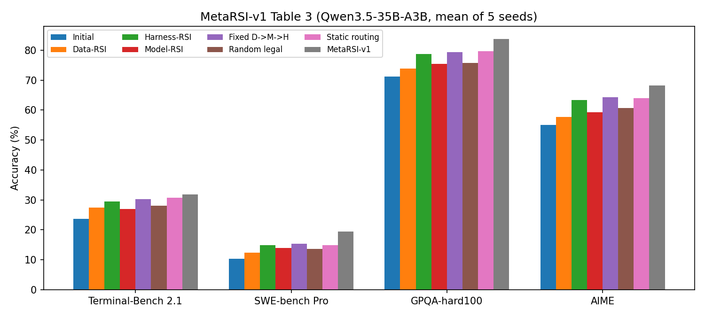
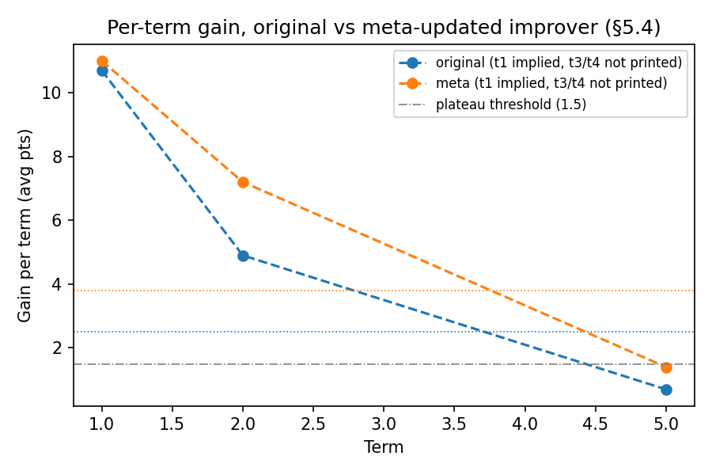
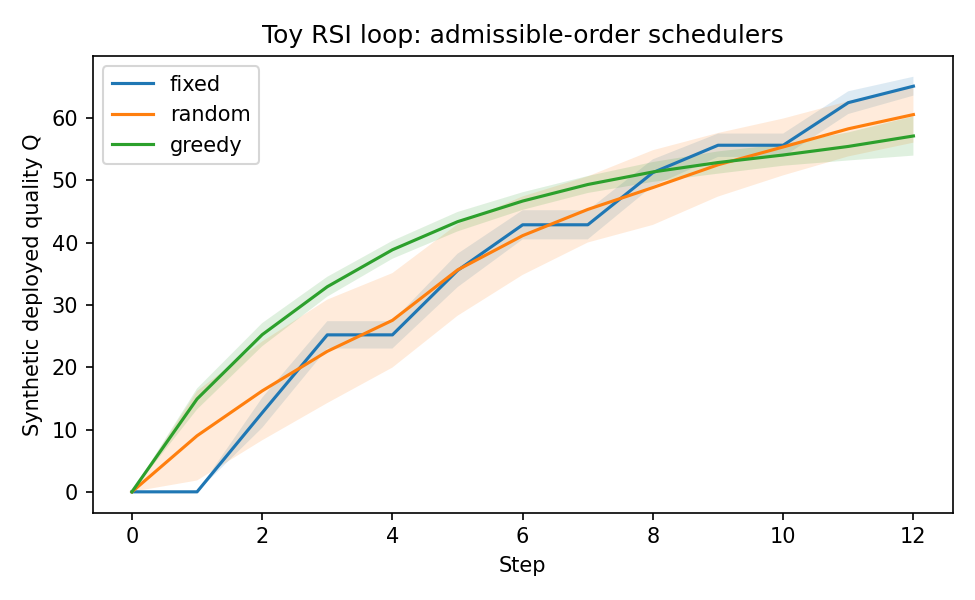
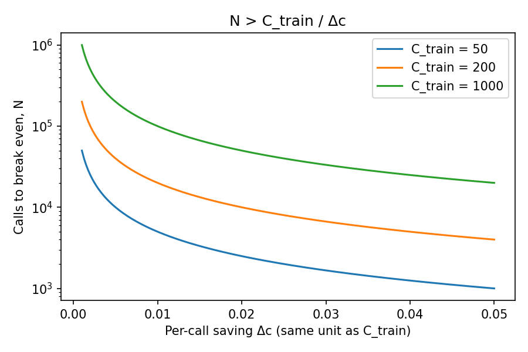

# MetaRSI-v1 

> [arXiv](https://arxiv.org/html/2609.06396v1)

一句话结论：这篇论文最值钱的部分是工程组织方式——把数据、运行框架、模型训练和三者的调度放进同一条可审计的流程里。实验说明组合改进有效，但撑不起作者提出的全部“五条规律”，也没有展示出加速的递归自改进。

---

## 1. 问题定义

模型做不好一个任务，原因不一定在权重里：可能缺知识，可能没用对工具，也可能少了一步验证。所以作者把被改进的对象定义为：

$$
S=(\mathcal{D},\theta,\mathcal{H})
$$

| 对象 | 含义 | 改进操作 |
|---|---|---|
| $\mathcal{D}$ | 数据、合成记录、训练课程 | Data-RSI |
| $\theta$ | 参数、适配器及受限训练配置 | Model-RSI |
| $\mathcal{H}$ | 系统提示、记忆、工具、技能、MCP 资源 | Harness-RSI |

论文关心的不是把某一项单独调好，而是面对当前失败时，先改哪项、怎么改、还值不值得继续花预算。[§3、§4.2](https://arxiv.org/html/2609.06396v1#S3)

顺序有实际影响。先加一道检查流程，可能跑出原本没有的成功轨迹；这些轨迹拿去训练；训练完再试着把额外提示删掉。每一步都改变下一步能拿到的证据。

作者的贡献分三层：给三种操作建统一接口和权限边界；同时优化操作顺序和每个操作内部的提案策略；跨轮次修改负责这些决策的调度策略。论文里各种 Agent 名称，都是这三层的实现角色。

---

## 2. 统一循环

三种操作共用一个内核：

> 观察 → 诊断 → 提案 → 校验 → 执行 → 选择 → 导出

模型只负责诊断和提案，其余阶段由受保护的运行代码执行。候选修改必须落在允许的字段内，跑过评分才能被接受。最终测试集、评估器、发布规则和资源账本不在任何操作的可改范围内。[§4.1、§4.7](https://arxiv.org/html/2609.06396v1#S4.SS1)

两个设计值得记下来。一是把“提出修改”和“宣布修改有效”分开，否则系统可以靠降低标准来涨分。二是每次修改都留下带来源、证据和成本的产物，下一步能直接消费，事后也能查。

不过评估器不可改，只能防止直接篡改评分规则，不能保证评分器完整、无偏或不被间接利用。系统仍可能对固定测试分布过拟合，或者钻测试覆盖的空子。“可审计”和“能力已被充分验证”之间还有距离。

---

## 3. 三个操作

**Data-RSI** 把执行经验变成训练记录。先从轨迹里提取四类诊断——知识缺口、推理错误、缺少验证、受干扰项影响——再生成数据构造指令和候选记录并验证。验证方式是一个角色出题写答案，另一个角色只看题目盲解，比对是否一致；两者是同一个目标模型，靠输入隔离防止抄答案。附录还规定了正确性、新颖性、来源检查，以及与密封测试数据去重。[§4.2.1、附录E](https://arxiv.org/html/2609.06396v1#S4.SS2.SSS1)

这比直接让模型“生成一批高质量数据”更有约束，但上限很明确：两次独立调用可能共享同一个知识错误，答案一致只说明自洽，不说明正确。作者也承认这点。代码任务可以再跑测试，缺外部真值的任务验证就弱得多。

**Harness-RSI** 修改执行任务的方式：系统提示、记忆、工具、技能和 MCP 配置。变更用有类型的补丁表达，附带修复假设、预期效果和风险。候选先在对应失败子集上重放，再合并到完整适应集上评估，同时限制上下文、记忆数量和配置大小。[§4.2.2](https://arxiv.org/html/2609.06396v1#S4.SS2.SSS2)

它的吸引力在于不需要训练权限，修改容易检查、版本化和回滚。代价是收益依赖这套框架是否加载，额外指令也会增加推理成本。

**Model-RSI** 把经验训练进模型。实验用 LoRA，在适配器位置、秩、目标模块、学习率等受限空间里提训练方案。论文说的“架构修改”实际是适配器和可训练模块配置，不是重新设计基础模型。一个关键细节：每个候选都从同一个固定基础模型出发，在累计数据上训练，而不是接着上一轮适配器继续训。这样训练路径可控，但训练成本要反复付。[§4.2.3](https://arxiv.org/html/2609.06396v1#S4.SS2.SSS3)

---

## 4. 形式化：顺序、证据时效与目标

论文一般地写出：

$$
U_j\circ U_i(S)\neq U_i\circ U_j(S)
$$

先后顺序会改变系统状态，也会改变后续操作看到的证据。

作者进一步规定：改过运行框架或模型之后，旧诊断产物视为过期；Model-RSI 必须用最近一次行为改变之后生成的数据。于是三个操作的六种相邻顺序只有五种合法，直接的 $H\to M$ 被禁止，要补成 $H\to D\to M$；连续 $M\to M$ 也受同一规则限制。[§4.3](https://arxiv.org/html/2609.06396v1#S4.SS3)

这是框架内部的契约，不是机器学习里的普遍定理。旧数据可能过时，也可能还有用——只改输出格式，未必让所有旧样本失效。论文选择整体作废，用重新采样的成本换简单的依赖管理，但没有证明这是最优取舍。

优化目标去掉排版细节后是：

$$
J=
\mathbb{E}\!\left[
\underbrace{Q^\star(S_T)-Q^\star(S_0)}_{\text{最终收益}}
-\lambda C
-\mu\,\mathrm{Reg}
-\nu\,\mathrm{Gap}
\right]
$$

$C$ 是改进成本，$\mathrm{Reg}$ 是原有能力退化，$\mathrm{Gap}$ 是工作反馈与最终测量的差异。预算同时计 token、墙钟时间、GPU 计算和验证查询。[§3.1](https://arxiv.org/html/2609.06396v1#S3.SS1)

方向是对的：部署收益要扣掉成本、遗忘和评估偏差。但正文主结果只报了准确率，没有把这个目标完整地数值化。目标函数写得全面，和实验验证了这个目标，是两回事。

---

## 5. 元递归在哪一层

| 层级 | 修改对象 | 含义 |
|---|---|---|
| 基础操作 | 数据、运行框架、模型 | 改进任务执行系统 |
| 双轴调度 | 操作顺序、操作提案策略 | 改进怎样开展改进 |
| 元层 | 调度策略的指令 | 根据整轮结果修正调度方式 |

横向调度决定下一步调用什么，纵向优化修改某个操作如何诊断和提案。一轮结束后，元层依据历史改动、成本和发布结果修正调度策略。层级到此为止：元层自身参数固定，没有无限向上的自修改。[§4.4—4.5](https://arxiv.org/html/2609.06396v1#S4.SS4)

由此带来一个实验问题：完整系统优于固定流程，究竟是顺序更好、操作策略更好，还是两者加额外搜索的合力？这需要逐个关闭组件来回答，而不是只比“完整系统”和“固定流水线”。

---

## 6. 实验结果

目标模型是 Qwen3.5-35B-A3B，所有模型驱动的角色都由它自己承担，不引入更强的教师模型。但正确性仍然依赖环境验证信号，“无更强教师”不等于“没有外部信息”。各条件预算配置相同，报告五个外层随机种子的均值。[§5.1](https://arxiv.org/html/2609.06396v1#S5.SS1)

主结果如下，最后一列是相对初始系统的平均百分点提升：

| 方法 | Terminal-Bench 2.1 | SWE-bench Pro | GPQA-hard100 | AIME | 平均提升 |
|---|---:|---:|---:|---:|---:|
| 初始系统 | 23.6 | 10.3 | 71.2 | 55.0 | — |
| Data-RSI | 27.4 | 12.4 | 73.8 | 57.7 | +2.8 |
| Harness-RSI | 29.4 | 14.9 | 78.8 | 63.3 | +6.6 |
| Model-RSI | 27.0 | 14.0 | 75.4 | 59.3 | +3.9 |
| 固定 D→M→H | 30.3 | 15.3 | 79.4 | 64.3 | +7.3 |
| 随机合法组合 | 28.1 | 13.6 | 75.8 | 60.7 | +4.5 |
| 静态路由 | 30.8 | 14.9 | 79.6 | 64.0 | +7.3 |
| MetaRSI-v1 | **31.9** | **19.5** | **83.8** | **68.3** | **+10.9** |

来源：[表3](https://arxiv.org/html/2609.06396v1#S5.SS2)。按表中四舍五入的数据重算，完整系统平均提升 10.85，比固定流程高 3.55 个百分点，与作者报告一致。

结果支持三点：完整系统在四项测试上都优于所列基线；随机组合低于 Harness-RSI，说明多操作不是随便组合就有效；在本文设置下，改运行框架是最强的单操作路线。但四个基准等权平均只是一种汇总约定，既不是按题目数加权的总体正确率，也不是通用能力指标。

元层实验更接近回答“改进器本身有没有变好”。作者从同一个首轮产物分叉，一支继续用原始改进器，一支用元层更新后的改进器。第二轮平均增益分别为 4.9 和 7.2 个百分点，五轮累计 20.7 和 26.2。[§5.4](https://arxiv.org/html/2609.06396v1#S5.SS4) 起点相同、比较对象是改进器，这比单看最终分数更有说服力。

但两条路线的单轮收益都在下降，更新后的路线从第二轮 +7.2 降到第五轮 +1.4。实验展示的是收益衰减变慢、累计收益更高，不是加速增长。

---

## 7. 影响可信度的问题

**Data-RSI 单独提升的路径不清楚。** §4.3 把 Data-RSI 定义为不直接改变部署行为，表3 里它单独却提升了部署分数。数据是通过固定训练流程、检索记忆，还是别的机制进入推理？同样，Model-RSI 依赖数据，而初始数据状态是空的，其单操作基线的数据从哪来也没交代。[§4.3、§5.1—5.2](https://arxiv.org/html/2609.06396v1#S4.SS3) 这些可能有合理实现，但论文没有把链条讲清楚。

**组合收益归因不纯。** 完整框架还包含纵向策略修改和元层更新，仅凭表3 无法把额外收益全归到顺序选择上。更有力的消融应分别比较：仅动态顺序、仅操作策略更新、两者同时启用、是否启用元层。

**成本报告不足以审计“同预算”。** 正文列了预算维度，附录描述了账本，但没有给出可复现的具体预算值、实际消耗，以及计入元预算后的总成本。改进预算和元预算分开记账时，需要同时回答两个问题：相同改进预算下谁更好，相同总投入下谁更划算。[§5.1、附录F](https://arxiv.org/html/2609.06396v1#A6)

**均值没有不确定性。** 表3 未给标准差或置信区间。GPQA 子集只有 100 题，AIME 只有 60 题，小幅差异必须看种子间波动和逐题配对结果才能判断是否稳定。

**多轮复用同一密封测试集。** 每轮系统冻结后才开密封集，但多轮共用同一划分，元层又读取轮级发布反馈。这不直接构成泄漏，但需要确认测试结果是否影响后续策略、停止决定或人工选择——如果影响，“每轮只看一次”仍会形成跨轮适应。长期实验最好另留一个完全不参与改进决策的最终测试集。[§4.5、§5.4、附录F](https://arxiv.org/html/2609.06396v1#S5.SS4)

**文字与表格不一致。** §5.2 说没有单一操作在所有领域占优，但表3 中 Harness-RSI 在四项任务上都高于另外两个单操作。这不否定完整系统的收益，但削弱了关于操作互补性的论证。另外，正文要求候选准确率严格提升，流程示例却允许删减框架后准确率不变的候选通过。后者按成本收益接受是合理的，但需要明确写成规则。[§4.2.2、§4.6](https://arxiv.org/html/2609.06396v1#S4.SS6)

---

## 8. “五条规律”

论文后半从实验上升到关于自改进的普遍命题，每条都该降到证据允许的强度。[§6.7](https://arxiv.org/html/2609.06396v1#S6.SS7)

| 作者的命题 | 我的判断 |
|---|---|
| 验证条件决定自改进前沿 | 有相关性证据；尚未建立因果决定关系 |
| 系统改变后，自我描述过期 | 有用的保守规则；“所有旧证据都失效”过强 |
| 能力可在框架与权重间迁移，成本不同 | 工程上合理；迁移是否完整需实测 |
| 信任取决于哪些对象不可修改 | 是重要保护措施，不是充分保证 |
| 循环不创造能力，真正新增都来自外部 | 提醒关注信息来源很有价值；普遍结论未获证明 |

第一条有可核验的数据。按表8 重算：

| 统计量 | 重算结果 |
|---|---:|
| 验证层级与循环数量的 Spearman 相关 | −0.751 |
| 控制能力后，循环数量与验证层级的偏相关 | −0.665，p≈0.0049 |
| 控制验证层级后，循环数量与能力的偏相关 | +0.450，p≈0.0805 |

与论文一致。[附录A、表8](https://arxiv.org/html/2609.06396v1#A1) 但限制有三：领域样本少，能力指标来自不同模型和基准；循环数量也受研究热度、基础设施和数据可得性影响；“能力相关性不显著”不等于“能力没作用”。所以只能说便宜、明确的验证与现有自改进研究的分布高度相关，不能说验证是唯一瓶颈。

最后一条同样要小心：有限轨迹里没展示某项能力，不代表模型没有，可能只是采样不足或搜索方式不对。拿它做资源分配的启发式可以，当成测准的能力边界就过了。

---

## 9. 对实践的启发

如果用到 Agent 工程里，我会优先取四点：

1. 把失败轨迹变成有来源的改进证据：记录具体失败、修复假设和预期效果，不要只凭总分调提示。
2. 限制修改范围，隔离评估权限：候选修改以结构化补丁提交，方便检查和回滚。
3. 改系统后重新验证关键行为：旧证据保留，但标明适用的模型和配置版本。
4. 同时测准确率和成本：包括采样、验证、训练和元层决策成本，不只是最终推理成本。

训练内化是否划算可以粗算。若训练加验证额外花费 $C_{\text{train}}$，每次推理节省 $\Delta c$，则需要

$$
N>\frac{C_{\text{train}}}{\Delta c}
$$

次后续调用才能回本。这假设能力保持、调用量稳定；是我的推导，不是论文验证过的结论。

---

## 附录：代码与补充结果

目录下有两个脚本，依赖只需 numpy 和 matplotlib（仓库 `pyproject.toml` 已含）：

```bash
uv run python paper/rsi/metarsi_results.py   # 复算论文数字、生成图
uv run python paper/rsi/rsi_loop_sim.py      # 调度机制的玩具模拟
```

### A. 复算论文数字（`metarsi_results.py`）

脚本把表3、§5.3、§5.4 的数字抄进来重算。表3 的平均提升与论文一位小数一致，最大偏差 0.05。完整系统相对最强非完整基线的逐基准余量：

| 基准 | 余量 |
|---|---:|
| Terminal-Bench 2.1 | +1.1 |
| SWE-bench Pro | +4.2 |
| GPQA-hard100 | +4.2 |
| AIME | +4.0 |

Terminal-Bench 上只领先 1.1 分，结合第 7 节说的缺标准差，这一项是否稳定最难判断。



§5.4 只印了第二轮、第五轮和 2–5 轮均值，脚本反推出没印的量：

| 路线 | 2–5 轮之和 | 反推第 1 轮 | 反推第 3+4 轮 |
|---|---:|---:|---:|
| 原始改进器 | 10.0 | 10.7 | 4.4 |
| 元层更新 | 15.2 | 11.0 | 6.6 |

两条路线从同一个首轮产物分叉，第 1 轮增益本应相同且等于表3 的 +10.9；反推得 10.7 和 11.0，0.3 的差在一位小数四舍五入范围内，说明文中数字自洽。



§5.3 前沿模型 {D, H} 循环三轮增益 7.3 / 2.8 / 1.2，累计 11.3，车队均值 80.0 → 91.3，加法成立。逐轮保留率 0.38、0.43，衰减形状与 35B 模型上的五轮实验一致。

### B. 调度机制的玩具模拟（`rsi_loop_sim.py`）

合成环境，不复现论文结果，只把三件事写成可运行代码：状态三元组 `State(data, theta, harness)`；可行性规则 `admissible()`——H 或 M 之后置 `needs_fresh_data`，只有 D 能清掉，于是 H→M、M→M 不可行；单步目标 `objective()` 按 $J=\Delta Q-\lambda C-\mu\,\mathrm{Reg}-\nu\,\mathrm{Gap}$ 计。

三个调度器在 12 步、50 个种子下的结果：

| 调度器 | 最终 Q | 总成本 | 示例轨迹 |
|---|---:|---:|---|
| 固定 D→M→H | 65.1 ± 1.5 | 26.0 | D→M→H→D→M→H→… |
| 随机可行 | 60.6 ± 4.5 | 19.9 | H→H→D→D→H→… |
| 单步贪心 / 成本 | 57.1 ± 3.2 | 18.4 | H→H→H→H→… |

单步按成本归一的贪心退化成只改 harness：M 贵且收益要等 D 积累后才显现，一步前瞻永远看不到。这正好对应论文里"静态路由"与"学习到的调度"的差距——顺序决策需要跨步的信用分配，不是逐步比性价比。改 `COST`、`quality()` 里的冗余项系数，结论会变，这也是玩具模型该有的样子。



### C. 回本估算



`breakeven_calls(c_train, delta_c)` 直接算 $N>C_{\text{train}}/\Delta c$。示例：训练加验证花 200 单位，每次推理省 0.01，需要 2 万次调用回本；省 0.002 则要 10 万次。

---

总评：MetaRSI-v1 给出了一套值得借鉴的受控自改进设计，主实验也显示它优于所列固定流程。最需要补的是基线定义、完整成本、不确定性和层级消融。稳妥的定位是“带元策略更新的受控自改进框架”，跨领域普适性和五条宏观规律仍是待检验的主张。